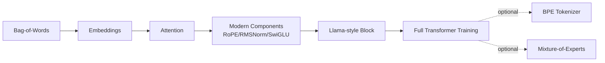

# Build an LLM from Scratch — Pokémon Edition


A progressive, notebook-driven course that builds a modern decoder-only
language model from raw text, entirely from scratch in PyTorch (no
HuggingFace), sized to train on a laptop in minutes. Instead of Shakespeare,
you train on **Pokémon** — Pokédex entries, move descriptions, and ability
text, fetched live from the free [PokeAPI](https://pokeapi.co).

## The 80/20 rule

This course is split into two tiers on purpose:

- **Notebooks 00-08 are the core path.** They take you from "I can write a
  for loop" to "I trained a working transformer language model and
  understand every piece of it." Stop at 08 and you have a complete, working,
  from-scratch LLM — that's ~80% of the value for ~50% of the notebooks.
- **Notebooks 09-10 are bonus / advanced.** A from-scratch BPE tokenizer and
  a Mixture-of-Experts capstone — real production techniques, genuinely
  optional. Do them if you're curious; skip them with no guilt.

Within the core path, **notebook 03 (Attention)** gets the most explanation
time of any notebook in the course — it's the one idea that turns an
order-blind model into a real language model.

## The Learning Journey



Each new method earns its place by beating a **measured** number from the
step before. Every notebook teaches step by step in plain language, with
runnable code, inline plots, `assert`-based sanity checks, and a
comprehension quiz at the end so you can test yourself before moving on.

## The Curriculum

| # | Notebook | Tier | What you build |
|---|----------|------|-----------------|
| 00 | Setup & tour | core | environment check, device detection, the roadmap |
| 01 | Data & Bag-of-Words | core | word-level tokenizer; a BoW next-word baseline |
| 02 | Embeddings | core | dense embeddings that beat BoW with far fewer parameters |
| 03 | Attention | **core — the big one** | scaled dot-product → causal mask → multi-head → GQA |
| 04 | Modern components | core | RoPE, RMSNorm, SwiGLU — each vs. the older idea it replaces |
| 05 | Assembling the model | core | tour of the full Llama-style decoder block, weight tying, param counts |
| 06 | Training | core | the training loop, loss curves, checkpointing |
| 07 | Evaluation & generation | core | perplexity, sampling strategies, KV-cache |
| 08 | Tuning | core | LR warmup + cosine decay, hyperparameter sweeps |
| 09 | BPE tokenizer | bonus | Byte-Pair Encoding from scratch vs. char-level |
| 10 | Mixture-of-Experts | bonus | top-k routing + load balancing; the capstone |

## Architecture Overview

The reusable model lives in [`model.py`](model.py). It's a modern
Llama-style architecture (ported from the course this repo is based on —
see [Credits](#credits)):

- **Positional Embeddings:** Rotary Positional Embeddings (RoPE)
- **Normalization:** RMSNorm
- **Activation Function:** SwiGLU
- **Attention Mechanism:** Grouped-Query Attention (GQA)
- **Inference Optimization:** KV-caching for fast generation

## The dataset

Every notebook trains on the same corpus: Pokémon species descriptions plus
move and ability flavor text, fetched from
[PokeAPI](https://pokeapi.co) — a free, public, no-auth API built for exactly
this kind of use (no scraping, no copyright concerns). `data/pokemon_fetch.py`
builds and caches it to `data/pokemon_corpus.txt` (~1MB, comparable in size to
the classic TinyShakespeare dataset). It's rebuilt automatically the first
time any notebook needs it.

## Setup

### Prerequisites
- Python 3.10+
- `pip` or `uv`

### Installation
```bash
python3 -m venv .venv
source .venv/bin/activate          # macOS / Linux
# .venv\Scripts\Activate.ps1       # Windows (PowerShell)
pip install -r requirements.txt
```

### Hardware
The notebooks auto-detect the best available device: CUDA (NVIDIA GPU) →
MPS (Apple Silicon) → CPU. Nothing in this course *requires* a GPU — every
notebook is designed to finish in a reasonable time on CPU alone.

## Running on Google Colab

```python
!git clone <this-repo-url>
%cd train-llm-pokemon
!pip install -r requirements.txt
```

**A Colab-specific note (read this):** opening a notebook on Colab can land
you on a brand-new virtual machine with an empty disk, even if you ran a
different notebook from this repo minutes ago. The original course this repo
is adapted from had exactly this bug — several notebooks assumed a file an
earlier notebook produced (the downloaded corpus, a trained checkpoint) was
already on disk, and crashed with `FileNotFoundError` or `sys.exit(1)` when
it wasn't.

Every notebook here is **cold-start safe** instead: if something it needs is
missing, it regenerates it automatically (the corpus re-downloads in
seconds; a missing checkpoint retrains a quick version rather than crashing).
See `notebooks/_shared.py` for how. If you'd rather avoid any re-work across
sessions, mount Google Drive and point the repo's `data/`, `checkpoints/`,
and `assets/` folders there — notebook 00 has the exact steps.

## How to run

Notebooks live in `notebooks/` as jupytext-paired files: a `.py` source (the
version-controlled truth) and a generated `.ipynb`. Open the `.ipynb` in
JupyterLab:
```bash
jupyter lab
```
Or run one headlessly:
```bash
python notebooks/01_data_and_bag_of_words.py
```

### How to learn effectively
- **Observe the plots** — every notebook has inline visualizations of how the
  model's behavior changes as you add complexity.
- **Take the quiz** — every notebook ends with a "✅ Check your understanding"
  section. Answer it yourself before expanding the collapsed answer key.
- **Modify & break things** — change a hyperparameter and watch what happens
  to the loss curves in notebook 06. That's how the intuition sticks.

## Credits

This course's structure, notebook progression, and the model architecture in
`model.py` are adapted from
[orbek/train-llm](https://github.com/orbek/train-llm) (Apache-2.0). See
[NOTICE](NOTICE) and [LICENSE](LICENSE). All course text, explanations,
quizzes, and the Pokémon training corpus are original to this project.
